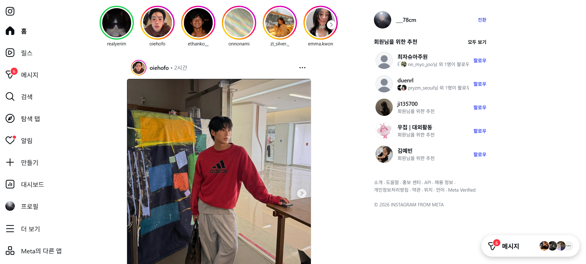

# 📸 Instagram Clone

인스타그램의 핵심 기능을 클론 코딩한 풀스택 웹 애플리케이션입니다.

---

## 📋 목차

- [프로젝트 소개](#-프로젝트-소개)
- [기술 스택](#-기술-스택)
- [아키텍처](#-아키텍처)
- [구현 기능](#-구현-기능)
- [프로젝트 구조](#-프로젝트-구조)
- [API 명세](#-api-명세)
- [시작하기](#-시작하기)

---

## 🎯 프로젝트 소개

React + Django REST Framework 기반의 인스타그램 클론 프로젝트입니다.  
현 인스타그램 UI/UX를 최대한 재현하였으며, 게시물 업로드·좋아요·댓글·팔로우 등 핵심 소셜 기능을 구현하였습니다.



---

## 🛠 기술 스택

### Frontend

| 기술 | 버전 | 역할 |
|------|------|------|
| React | 19.x | UI 라이브러리 |
| React Router DOM | 7.x | 클라이언트 사이드 라우팅 |
| Axios | 1.x | HTTP 통신 및 인터셉터 |
| Context API | - | 전역 인증 상태 관리 |
| CSS Variables | - | 다크/라이트 테마 시스템 |

### Backend

| 기술 | 버전 | 역할 |
|------|------|------|
| Python | 3.x | 서버 언어 |
| Django | 5.2 | 웹 프레임워크 |
| Django REST Framework | 3.15 | REST API |
| dj-rest-auth | 6.0 | 인증 엔드포인트 |
| django-allauth | 0.63 | 회원가입/소셜 인증 |
| djangorestframework-simplejwt | 5.3 | JWT 토큰 인증 |
| django-cors-headers | 4.3 | CORS 처리 |
| Pillow | 10.x | 이미지 처리 |
| SQLite | - | 개발용 데이터베이스 |

---

## 🏗 아키텍처

```
┌─────────────────────────────────────────────────────┐
│                   Client (Browser)                   │
│                                                      │
│  ┌─────────────┐    ┌──────────────────────────┐    │
│  │  React App  │    │      localStorage         │    │
│  │  (port 3000)│    │  access_token             │    │
│  │             │    │  refresh_token            │    │
│  └──────┬──────┘    └──────────────────────────┘    │
└─────────┼───────────────────────────────────────────┘
          │ HTTP (Bearer Token)
          ▼
┌─────────────────────────────────────────────────────┐
│              Django REST API (port 8000)             │
│                                                      │
│  ┌──────────────┐  ┌──────────────┐                 │
│  │  /api/auth/  │  │  /api/posts/ │                 │
│  │  /api/users/ │  │              │                 │
│  └──────┬───────┘  └──────┬───────┘                 │
│         │                 │                          │
│  ┌──────▼─────────────────▼──────┐                  │
│  │         Django ORM            │                  │
│  └──────────────┬────────────────┘                  │
└─────────────────┼───────────────────────────────────┘
                  │
       ┌──────────┴──────────┐
       │                     │
┌──────▼──────┐    ┌─────────▼────────┐
│  SQLite DB  │    │  media/ (images) │
│  db.sqlite3 │    │  posts/          │
│             │    │  profile/        │
└─────────────┘    └──────────────────┘
```

### 인증 흐름

```
클라이언트                          서버
    │                                │
    │── POST /api/auth/login/ ──────▶│
    │                                │ JWT 발급
    │◀── { access, refresh, user } ──│
    │                                │
    │  localStorage 저장             │
    │  (access_token, refresh_token) │
    │                                │
    │── GET /api/posts/              │
    │   Authorization: Bearer <token>│
    │                               ▶│ 토큰 검증
    │◀── 200 OK { posts }  ──────────│
    │                                │
    │  (토큰 만료 시)                 │
    │── POST /api/auth/token/refresh/│
    │   { refresh }  ───────────────▶│
    │◀── { access } ─────────────────│
```

---

## ✅ 구현 기능

### 인증
- [x] 회원가입 (아이디 / 이메일 / 비밀번호)
- [x] 로그인 / 로그아웃 (JWT)
- [x] Access Token 자동 갱신 (Refresh Token)
- [x] 인증 전역 상태 관리 (AuthContext)

### 게시물
- [x] 이미지 업로드 (드래그앤드롭 / 파일 선택)
- [x] 캡션 작성 (최대 2,200자)
- [x] 피드 조회 (최신순)
- [x] 게시물 삭제
- [x] 이미지 영구 저장 (서버 파일시스템)

### 좋아요 / 댓글
- [x] 좋아요 / 취소 토글
- [x] 더블클릭 하트 애니메이션
- [x] 댓글 작성 / 삭제
- [x] 댓글 더보기

### 소셜
- [x] 팔로우 / 언팔로우
- [x] 추천 유저 목록
- [x] 유저 검색 (실시간)

### 프로필
- [x] 프로필 페이지 (3컬럼 게시물 그리드)
- [x] 팔로워 / 팔로잉 수
- [x] 프로필 이미지 / 소개 / 웹사이트 편집

### UI/UX
- [x] 현 인스타그램 디자인 재현
- [x] 좌측 사이드바 (아이콘 전용 → 호버 시 레이블 확장)
- [x] 스토리 바 UI
- [x] 탐색 페이지 (그리드)
- [x] 완전 반응형 (데스크탑 / 태블릿 / 모바일)
- [x] 모바일 하단 네비게이션

---

## 📁 프로젝트 구조

```
instagram_clone/
├── backend/                        # Django 백엔드
│   ├── config/
│   │   ├── settings.py             # 프로젝트 설정
│   │   └── urls.py                 # 루트 URL 라우터
│   ├── users/                      # 유저 앱
│   │   ├── models.py               # User, Follow 모델
│   │   ├── serializers.py          # 유저 시리얼라이저
│   │   ├── views.py                # 프로필, 팔로우, 검색 뷰
│   │   └── urls.py                 # 유저 URL
│   ├── posts/                      # 게시물 앱
│   │   ├── models.py               # Post, Like, Comment 모델
│   │   ├── serializer.py           # 게시물 시리얼라이저
│   │   ├── views.py                # 게시물, 좋아요, 댓글 뷰
│   │   └── urls.py                 # 게시물 URL
│   ├── media/                      # 업로드 이미지 저장소 (gitignore)
│   ├── requirements.txt            # Python 패키지 목록
│   └── manage.py
│
└── frontend/                       # React 프론트엔드
    └── src/
        ├── api/
        │   └── axios.js            # Axios 인스턴스 + 인터셉터
        ├── contexts/
        │   └── AuthContext.js      # 전역 인증 상태
        ├── components/
        │   ├── Icons.js            # SVG 아이콘 모음
        │   ├── layout/
        │   │   ├── Sidebar.js      # 좌측 사이드바 (데스크탑)
        │   │   └── MobileNav.js    # 하단 네비게이션 (모바일)
        │   ├── post/
        │   │   ├── PostCard.js     # 게시물 카드
        │   │   └── CreatePostModal.js  # 게시물 업로드 모달
        │   └── stories/
        │       └── StoriesBar.js   # 스토리 바
        ├── pages/
        │   ├── LoginPage.js        # 로그인
        │   ├── SignupPage.js       # 회원가입
        │   ├── HomePage.js         # 피드 홈
        │   ├── ProfilePage.js      # 프로필
        │   └── ExplorePage.js      # 탐색 + 검색
        ├── App.js                  # 라우터 + 레이아웃
        └── index.css               # 전역 스타일 (CSS Variables)
```

---

## 📡 API 명세

### 인증

| Method | URL | 설명 | 인증 |
|--------|-----|------|------|
| POST | `/api/auth/registration/` | 회원가입 | ❌ |
| POST | `/api/auth/login/` | 로그인 | ❌ |
| POST | `/api/auth/logout/` | 로그아웃 | ✅ |
| GET | `/api/auth/user/` | 내 정보 조회 | ✅ |
| POST | `/api/auth/token/refresh/` | 토큰 갱신 | ❌ |

### 게시물

| Method | URL | 설명 | 인증 |
|--------|-----|------|------|
| GET | `/api/posts/` | 전체 피드 조회 | ✅ |
| POST | `/api/posts/` | 게시물 업로드 | ✅ |
| DELETE | `/api/posts/{id}/` | 게시물 삭제 | ✅ |
| POST | `/api/posts/{id}/like/` | 좋아요 토글 | ✅ |
| GET | `/api/posts/{id}/comments/` | 댓글 목록 | ✅ |
| POST | `/api/posts/{id}/comments/` | 댓글 작성 | ✅ |
| DELETE | `/api/posts/comments/{id}/` | 댓글 삭제 | ✅ |
| GET | `/api/posts/user/{username}/` | 유저 게시물 | ✅ |

### 유저

| Method | URL | 설명 | 인증 |
|--------|-----|------|------|
| GET | `/api/users/{username}/` | 프로필 조회 | ✅ |
| PATCH | `/api/users/{username}/` | 프로필 수정 | ✅ |
| POST | `/api/users/{username}/follow/` | 팔로우 토글 | ✅ |
| GET | `/api/users/search/?q=` | 유저 검색 | ✅ |
| GET | `/api/users/suggested/` | 추천 유저 | ✅ |

---

## 🚀 시작하기

### 사전 요구사항

- Python 3.10+
- Node.js 18+
- pip

### 백엔드 실행

```bash
cd backend

# 패키지 설치
pip install -r requirements.txt

# 마이그레이션
python manage.py migrate

# 슈퍼유저 생성 (선택)
python manage.py createsuperuser

# 서버 실행
python manage.py runserver
```

### 프론트엔드 실행

```bash
cd frontend

# 패키지 설치
npm install

# 개발 서버 실행
npm start
```

### 접속

| 서비스 | URL |
|--------|-----|
| 프론트엔드 | http://localhost:3000 |
| 백엔드 API | http://127.0.0.1:8000 |
| 관리자 페이지 | http://127.0.0.1:8000/admin |

---

## 📌 환경 변수

프로덕션 배포 시 `backend/config/settings.py`에서 아래 값을 환경 변수로 분리하세요.

```python
SECRET_KEY=your-secret-key
DEBUG=False
ALLOWED_HOSTS=your-domain.com
DATABASE_URL=postgresql://...
```

---

## 🔮 향후 개발 계획

- [ ] 스토리 기능 (24시간 자동 삭제)
- [ ] 릴스 (짧은 동영상)
- [ ] 실시간 알림 (WebSocket)
- [ ] DM (다이렉트 메시지)
- [ ] 게시물 다중 이미지
- [ ] PostgreSQL + AWS S3 연동
- [ ] Docker 컨테이너화
- [ ] CI/CD 파이프라인
